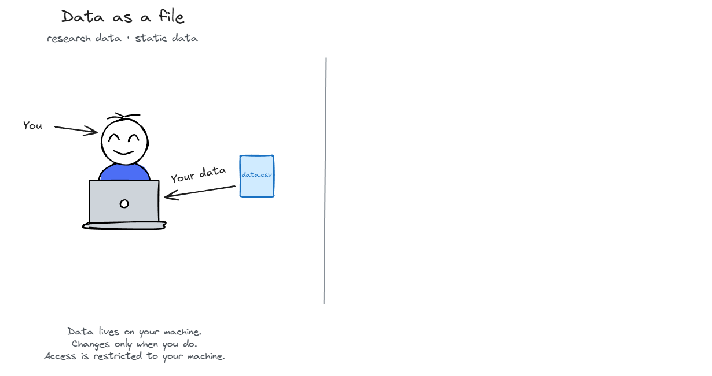
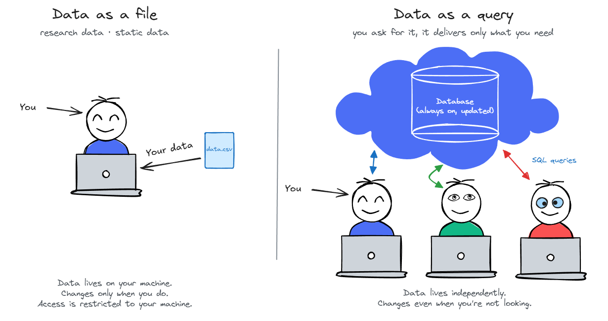
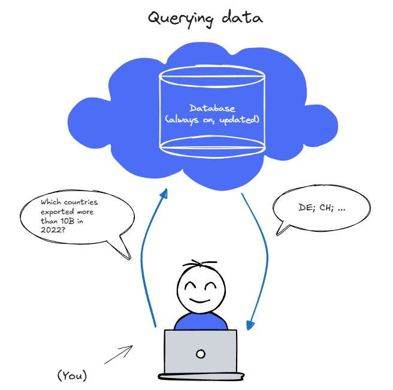
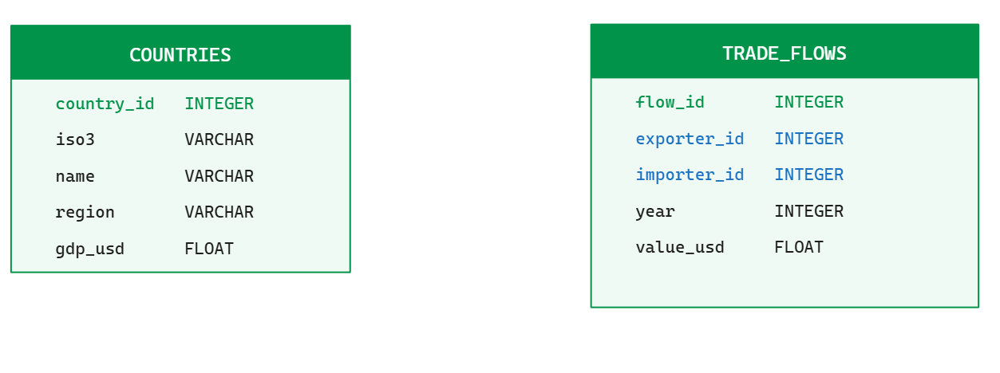
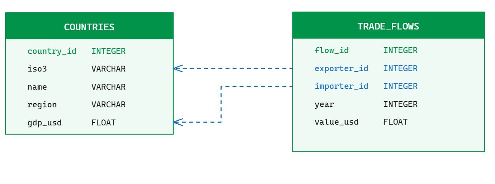
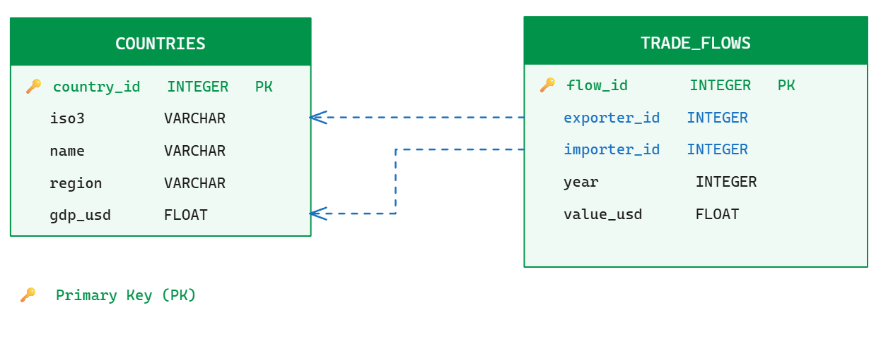
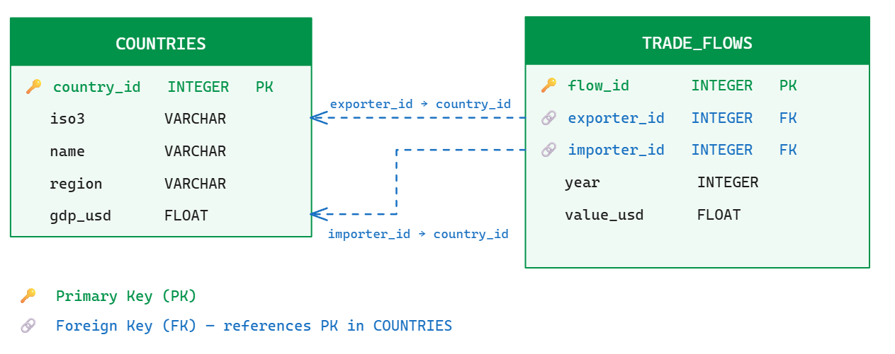
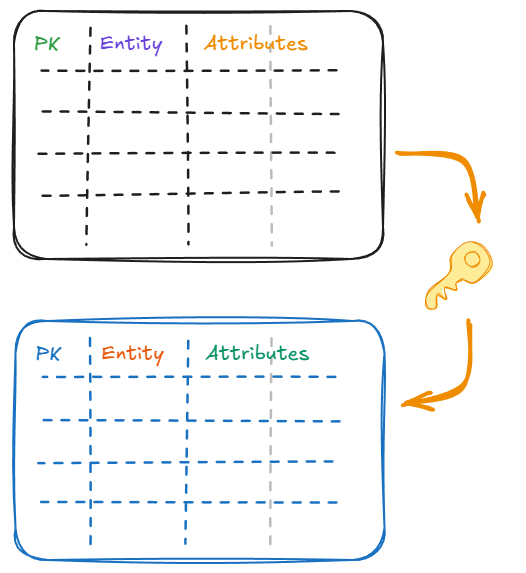
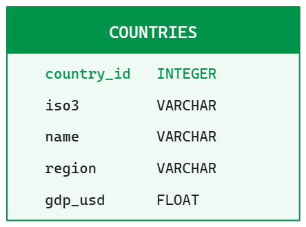
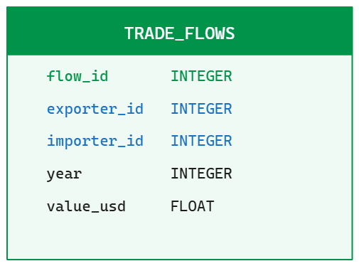

## Two ways to look at data

{fig-align="center" width="100%"}


## Two ways to look at data

{fig-align="center" width="100%"}

::: {.notes}
The key difference is not just where the data lives, it is how you access it.

With a file, you load everything into memory: `pd.read_csv("data.csv")` pulls the entire dataset into RAM. That works fine for a 10 MB file. It breaks when your dataset is 50 GB — you simply run out of memory.

With a database, you send a query and get back only the rows and columns you asked for. The database does the filtering on disk, before anything reaches your machine. Your RAM only ever sees the result, not the raw data.

This is the fundamental shift: from "give me everything, I'll figure it out" to "I know exactly what I want, give me that."

The other consequence: because the data lives independently on a server or a file on disk, multiple people can query it at the same time. It doesn't belong to any one session. That's what makes it a "service" — and also what makes it the right tool for shared, live, or large data.
:::

<!--
Notes from Matter, pages 124 -
- use stand-alone databases when: data is large and must be stored efficiently (i.e. on disk, not in memory), data is relational (multiple tables linked by keys), and/or multiple people need to access the same data
- use databases when data is not static — when it is updated frequently, or when you need to ensure data integrity and consistency over time

relational data model: data is organized into tables (relations) with rows (tuples) and columns (attributes). Tables are linked through keys (primary and foreign keys). This model allows for efficient storage, querying, and maintenance of data integrity.
RDBMS: row-based relational database management system, optimized for transactional workloads (OLTP). Examples: MySQL, PostgreSQL, SQLite. Not ideal for analytical queries over large datasets.
made for storing clean data in clearly defined set of tables, with defined properties.  Rows are indexed according to unique identifiers. Good for business data (transactions), not for analytics.

NoSQL: column-based, document-based, key-value based or graph-based models. Optimized for horizontal scaling, optimized to give quick answers based on summarizing large amounts of data.


relational data bmodel:

- dataset split by columns into tables to reduce the storage of redundant data and to maintain data integrity. Linked through keys. Efficient storage. Key columns are indexed
## Two ways to look at data
-->


## Two ways to look at data

:::: {.columns style="font-size: 0.85em;"}
::: {.column width="50%"}
#### **Data in memory**: pandas, polars, dplyr
:::
::: {.column width="50%"}
#### **Data in a database**: SQL
:::
::::

:::: {.fragment .columns style="font-size: 0.85em;"}
::: {.column width="50%"}
- You load data into RAM and manipulate it with code
:::
::: {.column width="50%"}
- You send **queries** to a database, which returns only what you ask for
:::
::::

:::: {.fragment .columns style="font-size: 0.85em;"}
::: {.column width="50%"}
- The data **lives in memory**, temporary, on RAM
:::
::: {.column width="50%"}
- The data **lives in a database**, persistent, on disk or in the cloud
:::
::::

:::: {.fragment .columns style="font-size: 0.85em;"}
::: {.column width="50%"}
- Size is small and can fit in memory
:::
::: {.column width="50%"}
- Large datasets that don't fit in memory
:::
::::

:::: {.fragment .columns style="font-size: 0.85em;"}
::: {.column width="50%"}
- You work on the whole dataset at once
:::
::: {.column width="50%"}
- You operate on "parts/subsets" of the data through querying
:::
::::

:::: {.fragment .columns style="font-size: 0.85em;"}
::: {.column width="50%"}
- For statistical analysis, plotting, typical data workflow in research, small projects
:::
::: {.column width="50%"}
- For data that needs to stay consistent over time, for data that is updated frequently, for data that is shared across multiple users/systems, for production applications
:::
::::


## Example from my work

- With health insurance claims data, data arrive continuously from hospitals, labs, pharmacies, and are stored in a database, which is continuously updated.
- All the data are stored in a **D**ata **W**are**H**ouse (DWH), a central database based on OLAP and OLTP (we'll cover these terms later)
- I write **SQL queries** to extract data from the DWH
- Queries can be very simple. Depending on the data, it can be quite tedious too (like invoice movements and moving from different aggregation levels)
- I then import the data into R or Python for analysis


## Goals for the next two weeks

#### CONSTRUCT a database

- understand why databases exist and what problem they solve
- know the relational model: tables, rows, keys, relationships

#### QUERY the database

- write our first simple SQL queries with DuckDB
- make more complex queries with JOINs, subqueries, and CTEs (next week)


# What is a database?

## What is a database?

<div style="margin-top: 1em;"></div>

Every app, every service, every research dataset you interact with is backed by a database.

<div style="margin-top: 1em;"></div>

:::: {.columns}

::: {.column width="50%"}

#### Structured data

- Customer records (name, address, country)
- Trade flows (year, exporter, importer, value)
- Survey responses (respondent\_id, question, answer)

:::

::: {.column width="50%"}

#### Unstructured data

- Text, emails, news articles
- Images, audio, video

:::

::::

<div style="margin-top: 1.5em;"></div>

##### A database is an organized collection of data.

::: {.notes}
In the case of structured data, the organization is based on the relational model, which we will cover in a moment. In the case of unstructured data, the organization can be more flexible, but it still relies on some form of indexing and metadata to allow for efficient retrieval. For instance, data lakes or document databases store unstructured data but still have a way to query it based on metadata or content.
:::


## Managing databases

#### A **Database Management System (DBMS)** is the software that sits between you and the data.

:::: {.columns}

::: {.column width="55%"}

<div style="margin-top: 1em;"></div>

- You send it a query: *"Which countries exported more than 10B in 2022?"*
- It returns the answer.

You never touch or manipulate the raw data directly. The DBMS handles storage, indexing, and access. It serves you the data on a silver platter.

:::

::: {.column width="45%"}

<div style="margin-top: -1em;"></div>

{width="90%"}

:::

::::


## Why use a DBMS?

Three elements are needed from your databases:

<!--Think of any firm: a bank, an insurer, an online shop. Or think of large data for your master's thesis on your own computer.-->

<div style="margin-top: 0.5em;"></div>

:::: {.columns style="font-size: 0.72em;"}

::: {.column width="33%"}

#### 1. Data independence & integrity

Many people/systems read and write the same data. **Data must stay correct** regardless of who touches it.

- Abstract view. No one touches raw storage
- Constraints enforce consistency automatically
- No conflicting CSV versions, no overwrites

:::

::: {.column width="33%"}

#### 2. Simple, efficient access

Apps, dashboards, and analysts all need to **extract data quickly**, without knowing where or how it is stored.<br>

- **SQL** is the standard interface across all databases
- The **query optimizer** decides *how* to run your query. You just say *what* you want.
- Enables **ETL**: Extract, Transform, Load pipelines

:::

::: {.column width="33%"}

#### 3. Governance & reliability

The system **cannot break down** (no failed transaction, a lost record, a data breach).<br><br>

- Transactions: operations either complete fully or not at all
- Crash recovery: data survives system failures
- Access control: who can read or write what

:::

::::


> Need 3 is enforced through **ACID** properties (Atomicity, Consistency, Isolation, Durability).


::: {.notes}
These are the four ACID properties that guarantee reliable database transactions:

**Atomicity**: a transaction is all-or-nothing. If a bank transfer debits one account but crashes before crediting the other, the whole operation is rolled back.

**Consistency**: a transaction can only bring the database from one valid state to another. It cannot violate constraints (PK, FK, NOT NULL, etc.).

**Isolation**: concurrent transactions don't interfere with each other. Each transaction sees the database as if it were running alone.

**Durability**: once a transaction is committed, it stays committed — even if the server crashes immediately after.

In practice for your course: the constraints you define with PRIMARY KEY, NOT NULL, REFERENCES are what enforce Consistency. The rest (Atomicity, Isolation, Durability) are handled by the DBMS (DuckDB, PostgreSQL, etc.) automatically.
:::


# The relational model

## Data lives in tables

##### The fundamental idea of *relational* databases: data is organized into **relations** (tables).

<div style="margin-top: 1em;"></div>

{width="90%"}


## Data lives in tables

##### The fundamental idea of *relational* databases: data is organized into **relations** (tables).

<div style="margin-top: 1.4em;"></div>

Each table/relation has:

- A **(relation) schema**: the table name, column names, and their types (or domain)
- **Columns** (attributes): one variable per column
- **Rows** (records / tuples): one entry per observation

We can write the relation schema as:

```
Table(attribute_1: INT, attribute_2: VARCHAR, ...)
```

> Check the [🔎 Self-Study](#sec-terminology) for a quick note on the terminology of the relational model.


## Data lives in tables

##### The fundamental idea of *relational* databases: data is organized into **relations** (tables).

<div style="margin-top: 1em;"></div>

{width="90%"}

```
Countries(country_id: INT, iso3: VARCHAR, name: VARCHAR, region: VARCHAR, gdp_usd: FLOAT)
Trade_flows(flow_id: INT, exporter_id: INT, importer_id: INT, year: INT, value_usd: FLOAT)
```


## Relational databases are built on relationships

- A **relational database** is a collection of relations (tables) that are linked together through **keys**.

{width="90%"}


## Relationships are built on keys

#### Primary key
- Column (or set of columns) that **uniquely identifies each row**. If two tuples agree on the value(s) of the key, then they must be the same tuple.
- It is `NOT NULL` and `UNIQUE` by definition
- It allows other tables to **refer** to this table

<div style="margin-top: 1em;"></div>

> **Note:** A good primary key is stable (never changes), unique, and meaningless on its own: a number, not the country name, which could change. If no natural attribute works as a key, you create a **surrogate key** (an artificial integer ID). When a single column isn't enough, a **composite key** combines two or more columns.


## Relationships are built on keys

#### Primary key in our model?

{width="90%"}


## Relationships are built on keys

#### Primary key in our model?

{width="90%"}


::: {.fragment style="font-size: 0.8em;"}
- `country_id` in `Countries` is the primary key. It uniquely identifies each country.
- `flow_id` in `Trade_Flows` is the primary key for trade flows.
:::


## Relationships are built on keys

#### Foreign key
- A column (or set of columns) that refers to a primary key in another table. It creates a link between the two tables.
- Always in the referencing table (the "many" side of a one-to-many relationship)
- A **foreign key constraint** means: you cannot insert a row with a foreign key value that does not exist in the referenced table.
- This is known as **referential integrity**.


## Relationships are built on keys

#### What are the foreign keys in our model?

{width="90%"}


## Relationships are built on keys

#### What are the foreign keys in our model?

{width="90%"}


::: {.fragment style="font-size: 0.8em;"}
- `exporter_id` and `importer_id` in `TradeFlows` are foreign keys that **refer to** `country_id` in `Countries`
- The constraint: you cannot insert a trade flow for a country that does not exist in `Countries`. Every trade flow must reference an existing country.
:::


## Why split data into multiple tables?

##### Yes, why?

## Why split data into multiple tables?

Imagine storing everything in one table:

<div style="font-size: 0.75em;">

| flow\_id | exporter\_name | exporter\_region | importer\_name | importer\_region | year | value |
|:--------:|----------------|-----------------|----------------|-----------------|:----:|------:|
| 1        | Switzerland    | Europe          | Germany        | Europe          | 2022 | 45M   |
| 2        | Switzerland    | Europe          | France         | Europe          | 2022 | 38M   |

</div>

<div style="margin-top: 1em;"></div>

::: {.fragment}
- **Redundant storage**: `"Europe"` is 6 bytes; an integer ID is 4 bytes. Repeated across millions of rows, this compounds fast.
- **Update anomaly**: if Switzerland changes region, one update in `countries` fixes everything. In a flat table, you rewrite every single trade flow row.
- **Insertion anomaly**: to add `capital_city` to Switzerland, you add one column to `countries` (a small table). In a flat table, you add a column across millions of rows.
- **Deletion anomaly**: deleting all Swiss trade flows does not delete the fact that Switzerland is in Europe.
:::

::: {.fragment}
##### Split tables eliminate redundancy and keep data consistent.
:::


## Think in entities and relationships

Before writing any SQL, **sketch** the structure of your data. **Think visually** about your data structure and your schema design.

<div style="margin-top: 1.5em;"></div>

::: {.columns}
::: {.column width="60%"}
1. **Entities**: a *country*, a *firm*, a *survey respondent*, a *product*.
2. **Attributes**: the properties of each entity. In our example, each country has a name, a region, an income group.
3. **Relationships**: how entities connect with each other. <br>E.g., a trade flow *links* an exporter country to an importer country, or a survey response *belongs to* a respondent
:::
::: {.column width="40%"}
{width="70%" style="display: block; margin: -30px auto 0 auto; padding: 0;"}
:::
:::


<div style="margin-top: 1.5em;"></div>


> **Note**: The concept of "entity" is close to the idea of "unit of observation" in statistics. It is the "thing" that you are collecting data about.


## Write your schema in a simple text format first


#### For instance:

<div style="margin-top: 1.5em;"></div>

```
Countries(country_id: INT PK, iso3: VARCHAR, name: VARCHAR, region: VARCHAR, gdp_usd: FLOAT)

Trade_flows(flow_id: INT PK, exporter_id: INT FK->Countries, importer_id: INT FK->Countries, year: INT, value_usd: FLOAT)
```

<div style="margin-top: 1.5em;"></div>

- `PK` = primary key, `FK` = foreign key, `FK→Countries` means it references the `Countries` table
- This is an informal shorthand for sketching schemas, not a formal standard. Different textbooks use different conventions.


## Or use an ER diagram

**Mermaid** is a text-based diagram language for **entity-relationship diagrams** (ERDs). 🧜‍♀️ renders directly in Quarto.

:::: {.columns}
::: {.column width="45%"}

```
erDiagram
    COUNTRIES {
        int     country_id  PK
        varchar iso3
        varchar name
        varchar region
        float   gdp_usd
    }
    TRADE_FLOWS {
        int   flow_id      PK
        int   exporter_id  FK
        int   importer_id  FK
        int   year
        float value_usd
    }
    COUNTRIES ||--o{ TRADE_FLOWS : "exports"
    COUNTRIES ||--o{ TRADE_FLOWS : "imports"
```

:::
::: {.column width="55%"}

```{mermaid}
%%| echo: false
erDiagram
    COUNTRIES {
        int     country_id  PK
        varchar iso3
        varchar name
        varchar region
        float   gdp_usd
    }
    TRADE_FLOWS {
        int   flow_id      PK
        int   exporter_id  FK
        int   importer_id  FK
        int   year
        float value_usd
    }
    COUNTRIES ||--o{ TRADE_FLOWS : "exports"
    COUNTRIES ||--o{ TRADE_FLOWS : "imports"
```

:::
::::

<div style="font-size: 0.8em;">
It uses [crow's foot notation 🐦‍⬛](https://mermaid.ai/open-source/syntax/entityRelationshipDiagram.html) to show relationships between tables.

- `||` = one and only one
- `o{` = zero or more
:::

</div>

> See [mermaid.js.org](https://mermaid.js.org/syntax/entityRelationshipDiagram.html).


## Thinking in entities and relationships

::: {.columns}
::: {.column width="50%"}

#### Once you have a sketch, translating to SQL will be mechanical:

- Each **entity** → one table
- Each **attribute** → one column, with a type
- Each **relationship** → a foreign key

:::
::: {.column width="50%"}
{width="80%" style="display: block; margin: -20px auto 0 auto; padding: 0;"}
:::
:::


# An example of relational model: the star schema

## The star schema ⭐

- Most widely used to develop data warehouses
- Consists of one or more **fact tables** referencing any number of **dimension tables**.

<div style="margin-top: 1em;"></div>

:::: {.columns}

::: {.column width="50%"}
](../../assets/img/lecture_09_db/star_schema.png){width="80%"}
:::

::: {.column width="50%"}

- **Fact table** (`observations`). Long data, one row per measurement
- **Dimension tables** (`countries`, `indicators`). Metadata, usually wider because contains more attributes.
- 🔑 The fact table holds foreign keys to all dimensions
:::
::::


## The star schema ⭐

- An important concept in database design is **normalization**: the process of organizing data to minimize redundancy and improve integrity.
- It means moving repeated metadata into separate tables and replacing strings with integer IDs.

:::: {.columns style="font-size: 0.72em;"}
::: {.column width="50%"}

<div style="margin-top: 3em;"></div>

**`observations`** (lean fact table with millions of rows)

| country_id | indicator_id | year | value |
|---|---|---|---|
| 3 | 1 | 2020 | 45 234 |
| 3 | 1 | 2021 | 46 100 |
| 3 | 2 | 2020 | 3.8 |
| 4 | 1 | 2020 | 38 600 |

:::
::: {.column width="50%"}

**`countries`** (small but rich dimension table)

| country_id | name | region |
|---|---|---|
| 3 | Germany | Europe & Central Asia |
| 4 | France | Europe & Central Asia |

<div style="margin-top: 1.5em;"></div>

**`indicators`** (dimension — tiny)

| indicator_id | name |
|---|---|
| 1 | GDP per capita |
| 2 | Unemployment rate |

:::
::::

The **cost**: you need a JOIN to get readable labels. The **benefit**: consistency, compactness, flexibility.

> **Note:** Check the [🔎 Self-Study](#sec-normalization) for a quick note on the terminology of the star schema and normalization.


## The star schema ⭐ {background-color="black"}

We will explore a simple star schema with FRED data in the exercise session.


# From sketch to schema using SQL

## SQL — **S**tructured **Q**uery **L**anguage

::: {.columns}
::: {.column}
- SQL is not a programming language, it is a **query language**.
- You describe *what* you want, and the database figures out *how* to get it.
- It is very high level, highly optimized, and has been around for decades.
- Different "dialects" (standards and implementsation, which are incompletely compatible)
- 💪 Required skill for most data science positions in industry
:::
::: {.column}
](../../assets/img/lecture_09_db/sql_vs_squirrel.png){width="100%"}
:::
:::

> **Note:** Originally based upon relational algebra and tuple relational calculus. We won't go into details in this introductory course. I recommend Marco Venturini's lecture for more details.


## SQL — **S**tructured **Q**uery **L**anguage

<div style="margin-top: 1em;"></div>

SQL has five main parts:

- **DDL** — Data Definition Language: `CREATE TABLE`, `DROP TABLE`, `ALTER TABLE`
- **DML** — Data Manipulation Language: `INSERT`, `UPDATE`, `DELETE` records
- **DQL** — Data Query Language: `SELECT`
- **DCL** — Data Control Language (authorization): `GRANT`, `REVOKE`
- **TCL** — Transaction Control Language (manages changes in transactions): `COMMIT`, `ROLLBACK`, `SAVEPOINT`, `SET TRANSACTION`

<div style="margin-top: 1em;"></div>

In this course, we'll focus on DDL, DML and DQL.


## Atomic data types in SQL

  - The SQL standard defines a core set of data types.
  - Each dialect has its own extensions, but these are the most common:
    - Characters: `VARCHAR[(length)]` (Variable-length string, max n)
    - Numeric: `INTEGER`/`INT` (four-byte integers), `BIGINT` (64-bit integers), `SMALLINT` (16-bit integers), `FLOAT` (approximate floating-point), `DECIMAL(p, s)` (Exact fixed-point number with precision p and scale s)
    - Others: `DATE`, `TIME`, `DATETIME`/`TIMESTAMP`, `INTERVAL`, `BOOLEAN`

Refer to the documentation of each SQL dialect. For DuckDB, see https://duckdb.org/docs/current/sql/data_types/overview


## SQL constraints

Constraints enforce rules on your data at the database level.

<div style="margin-top: 1em;"></div>

| Constraint | What it does |
|---|---|
| `NOT NULL` | Column must always have a value |
| `UNIQUE` | No two rows can share the same value |
| `PRIMARY KEY` | NOT NULL + UNIQUE — the row's unique identifier |
| `FOREIGN KEY` | Value must exist in another table |
| `CHECK` | Custom condition, e.g. `CHECK (gdp_usd >= 0)` |
| `DEFAULT` | Auto-fills a value when none is provided |

<div style="margin-top: 1em;"></div>

> **Note:** Constraints are optional. They protect your data and document your intent. Use them.


## CREATE our first TABLE

- Creating a table means defining its **schema**: the column names, their types, and any constraints.
- The schema is self-documenting: anyone reading it knows the rules.

It follows a simple syntax:

::: {.columns}
::: {.column}
```sql
CREATE TABLE countries (
    id         INTEGER PRIMARY KEY,
    name       VARCHAR NOT NULL UNIQUE,
    region     VARCHAR,
    gdp_usd    FLOAT   CHECK (gdp_usd >= 0)
);
```
:::
::: {.column}
{width="50%" style="display: block; margin: -30px auto 0 auto; padding: 0;"}
:::
:::

<div style="margin-top: 1em;"></div>

- `country_id`: integer, the primary key: `NOT NULL` + `UNIQUE` by definition
- `name`: text, required (`NOT NULL`), no duplicates (`UNIQUE`)
- `region`: text, optional (no constraint — `NULL` is allowed)
- `gdp_usd`: number, constraint: must be non-negative


## Create a table with a FOREIGN KEY

A foreign key constraints says: *"this column's value must exist in another table."*

<div style="margin-top: 1em;"></div>

::: {.columns}
::: {.column width="60%"}
```sql
CREATE TABLE trade_flows (
    flow_id     INTEGER PRIMARY KEY,
    exporter_id INTEGER NOT NULL REFERENCES countries(country_id),
    importer_id INTEGER NOT NULL REFERENCES countries(country_id),
    year        INTEGER NOT NULL,
    value_usd   FLOAT   CHECK (value_usd >= 0)
);
```
:::
::: {.column width="40%"}
{width="50%" style="display: block; margin: -30px auto 0 auto; padding: 0;"}
:::
:::
<!-- end columns -->

<div style="margin-top: 1em;"></div>

- `REFERENCES countries(country_id)` — this is the foreign key constraint
- Will reject any insert where `exporter_id` has no matching row in `countries`
- Both `exporter_id` and `importer_id` point to the same table

<div style="margin-top: 1.5em;"></div>

::: {.aside}
DuckDB syntax: `REFERENCES table(column)` is equivalent to `FOREIGN KEY (col) REFERENCES table(col)` — the short form is cleaner for single-column keys.
:::


## What the foreign key actually prevents

#### 1. Inserting a row with a non-existent reference

```sql
-- This works: country 1 exists in countries
INSERT INTO trade_flows VALUES (1, 1, 2, 2022, 45000000);

-- This fails: country 99 does not exist
INSERT INTO trade_flows VALUES (2, 99, 2, 2022, 10000000);
-- Error: FOREIGN KEY constraint failed
```

<div style="margin-top: 1em;"></div>

::: {.fragment}
##### Why?
:::

::: {.fragment}
The database enforces **referential integrity**: every reference must point to an existing row. This prevents "orphan" records that reference non-existent entities.
:::


## What the foreign key actually prevents

#### 2. Deleting a referenced row

The constraint also works in the other direction: you cannot delete a row that is still referenced.

```sql
-- This fails: country 1 is referenced by trade_flows
DELETE FROM countries WHERE country_id = 1;
-- Error: Violates foreign key constraint
```

::: {.fragment}
```sql
-- You must delete the child rows first
DELETE FROM trade_flows WHERE exporter_id = 1 OR importer_id = 1;
DELETE FROM countries  WHERE country_id = 1;  -- now this works
```
:::

::: {.fragment}
##### The database protects referential integrity in both directions: on INSERT and on DELETE.
:::


## 🔎 Self-study: What the foreign key actually prevents

#### 3. Handling the deletion of a referenced row

The foreign key also controls what happens when you **delete a referenced row**.

<div style="margin-top: 1em;"></div>

```sql
CREATE TABLE trade_flows (
    flow_id     INTEGER PRIMARY KEY,
    exporter_id INTEGER NOT NULL
                REFERENCES countries(country_id) ON DELETE CASCADE,
    ...
);
```

<div style="margin-top: 1em;"></div>

| Action | Behaviour when you delete a country |
|---|---|
| `ON DELETE RESTRICT` | ❌ Delete is rejected — the country is still referenced |
| `ON DELETE CASCADE` | All trade flows for that country are deleted automatically |
| `ON DELETE SET NULL` | `exporter_id` is set to `NULL` in all affected rows |

<div style="margin-top: 1em;"></div>

> Note: on DuckDB, only `RESTRICT` is supported. `CASCADE` and `SET NULL` are not implemented yet, but they are common in other databases (PostgreSQL, MySQL, SQLite).


## INSERT — adding rows

```sql
-- Populate countries first (the referenced table must exist)
INSERT INTO countries VALUES (1, 'Switzerland', 'Europe', 905000000000);
INSERT INTO countries VALUES (2, 'Germany',     'Europe', 4072000000000);
INSERT INTO countries VALUES (3, 'Brazil',      'LATAM',  2081000000000);

-- Now populate trade flows
INSERT INTO trade_flows VALUES (1, 1, 2, 2022, 45000000);
INSERT INTO trade_flows VALUES (2, 2, 3, 2022, 120000000);
```

<div style="margin-top: 1em;"></div>

> **Note:** Always insert into the referenced table first. You cannot insert a trade flow for a country that doesn't exist yet.


# Creating a database

## The ETL pipeline

- On one hand, building a database is to set up the **architecture** of the data through a data model.
- On the other hand, the data has to get there to populate the model.

<div style="margin-top: 0.5em;"></div>

##### **ETL** = **E**xtract → **T**ransform → **L**oad

A common pipeline that fits well with the type of work we do in (Econ) research.

| Step | What happens | Tool |
|---|---|---|
| **Extract** | Read raw data from its source, often messy and wide format | `pandas`, `fredapi`, CSV, an app, a survey |
| **Transform** | Clean, reshape, tidy data, assign IDs | `pandas` |
| **Load** | Insert into the database, give it structure and queryable | SQL `INSERT` |


::: {.aside}
Source: [ETL](https://en.wikipedia.org/wiki/Extract,_transform,_load)
:::


## The ETL pipeline

**Why not load raw data directly into a database?**

- Raw data is often wide, messy, missing IDs
- SQL has no `melt()`, no regex-heavy cleaning
- pandas or tidyverse/data.table in R are the right tool for reshaping


**Another pipeline**: ELT: Extract, Load, Transform
Loads raw data directly into a warehouse before transforming it, enabling faster loading and greater flexibility than traditional ETL. Key usage examples include real-time analytics, big data processing, and centralizing data from diverse sources.


# Our tool: DuckDB

## The database universe

#### Hundreds of database products exist.

](https://substackcdn.com/image/fetch/$s_!2v_D!,f_auto,q_auto:good,fl_progressive:steep/https%3A%2F%2Fsubstack-post-media.s3.amazonaws.com%2Fpublic%2Fimages%2F3443cfc6-2a00-4568-b0fd-e60cc8dc1284_1400x900.png){fig-align="center" width="90%"}


## The most important split is **OLTP vs. OLAP**

<div style="margin-top: 0.5em;"></div>

:::: {.columns}
::: {.column width="50%"}

#### OLTP — Online Transaction Processing
##### PostgreSQL, MySQL, Oracle, SQLite

- One row at a time: inserts, updates, deletes
- High write frequency, strict data integrity
- Powers apps, payment systems, inventory
- **Running** the business (claims, subscriptions, inventory movements)

:::
::: {.column width="50%"}

#### OLAP — Online Analytical Processing
##### DuckDB, ClickHouse, Snowflake, BigQuery

- Millions of rows at once: aggregations, joins
- Read-heavy, optimised for full-column scans
- Powers dashboards, research, reporting
- **Understanding** the business, tailored for data analysis and research.

:::
::::

<div style="margin-top: 1.5em;"></div>

::: {.aside}
The distinction drives storage layout, indexing strategy, concurrency model. A database optimised for transactions is slow at analytics, and vice versa.
:::


::: {.notes}
**Storage layout — the concrete explanation:**

Row-oriented (PostgreSQL, Oracle): data stored row by row on disk.
  [1, Switzerland, Europe, 905B]  [2, Germany, Europe, 4072B]  ...
SELECT AVG(gdp_usd) reads every full row — name, region, everything — just to get one column.

Column-oriented (DuckDB): data stored column by column.
  country_id: [1, 2, 3, ...]
  name:       [Switzerland, Germany, Brazil, ...]
  gdp_usd:    [905B, 4072B, 2081B, ...]
SELECT AVG(gdp_usd) reads only the gdp_usd column and skips the rest.

With 200 rows the difference is invisible. With 50 million rows and 100 columns, SELECT AVG(salary) reads 1/100th of the data — 100x less disk I/O.

OLTP apps need the opposite: SELECT * FROM orders WHERE order_id = 42 reads one full row. With column storage that single row is scattered across 100 files — slow.
Rule of thumb: analytics = few columns, many rows → column wins. Apps = all columns, one row → row wins.

**Oracle:**
Oracle is a row-oriented RDBMS, same category as PostgreSQL — the dominant production database in large enterprises, banks, insurance, government. Proprietary, expensive, huge enterprise ecosystem. In my work I write SQL against an Oracle data warehouse. The syntax is almost identical to what we use here — differences are in advanced features (window functions, date handling). Oracle also sells analytical add-ons (Exadata) but the core engine is row-oriented OLTP.
:::


## In this course

{width="90%"}

We will use **DuckDB** — an OLAP database built for analytics and research.


## DuckDB is not a classic RDBMS

DuckDB speaks SQL, but it is an **analytical database**.

<div style="margin-top: 1em;"></div>

| | RDBMS (PostgreSQL, Oracle) | DuckDB |
|---|---|---|
| Optimised for | Writes, transactions | Reads, aggregations |
| Storage layout | **Row-oriented** | **Column-oriented** |
| Setup | Server process | In-process (like pandas) |
| Concurrency | Many writers | One writer, many readers |
| Use case | Production apps, OLTP | Analytics, research, OLAP |

<div style="margin-top: 1em;"></div>


## Where does each tool fit?

Two axes place every database product:

<div style="margin-top: 0.5em;"></div>

|  | **Self-hosted server** | **Cloud / managed** | **Embedded (in-process)** |
|---|---|---|---|
| **OLTP** — row, transactional | Oracle, PostgreSQL, MySQL | AWS Aurora, Cloud SQL | SQLite |
| **OLAP** — column, analytical | ClickHouse, Redshift | Snowflake, BigQuery | **DuckDB** ← us |

<div style="margin-top: 1em;"></div>

- **SQLite and DuckDB share the same architecture** — both embedded, no server, single file
- They differ on workload: SQLite stores app state (OLTP), DuckDB analyses data (OLAP)
- DuckDB's unique position: the only mature **embedded OLAP** engine

::: {.aside}
"Embedded" means the engine runs inside your process — `import duckdb` is all it takes. No port, no credentials, no daemon to manage.
:::


## Why DuckDB and not PostgreSQL or SQLite?

<div style="margin-top: 0.5em;"></div>

:::: {.columns style="font-size: 0.9em;"}

::: {.column width="33%"}

#### Oracle / PostgreSQL
##### Industry standard

- Production-grade, battle-tested
- What you will use in most data jobs
- Needs a server, credentials, administration
- Too much friction for a research course

:::

::: {.column width="33%"}

#### SQLite
##### Embedded — but for apps

- Also embedded, no server, single file
- **Row-oriented** — designed for app storage, not analytics
- Poor performance on aggregations over large data
- Same architecture as DuckDB, different workload

:::

::: {.column width="33%"}

#### DuckDB
##### Research & analytics

- `uv add duckdb` — no server to start
- Runs inside Python or R like pandas
- Reads CSV, Parquet, JSON directly
- Fast on analytical queries
- One `.db` file, shareable via git

:::
::::

<div style="margin-top: 1em;"></div>

::: {.fragment}
##### DuckDB is to analytical SQL what pandas is to dataframes: the default tool for data work that doesn't need a server.
:::


## We will use DuckDB as DBMS

A typical workflow: create a connection to a `.db` file, create tables, insert data, query with SQL, get results as a DataFrame. Once you're done, close the connection.

```python
import duckdb

# Open (or create) a .db file
conn = duckdb.connect("project.db")

# Create tables
conn.execute("""
    CREATE TABLE countries (
        country_id INTEGER PRIMARY KEY,
        name       VARCHAR NOT NULL UNIQUE,
        region     VARCHAR,
        gdp_usd    FLOAT
    )
""")

# Query → pandas DataFrame
df = conn.execute(
    "SELECT * FROM countries"
).df()

conn.close()
```


## We will use DuckDB as DBMS

DuckDB is both usable with Python and R — the same `.db` file, no conversion.

:::: {.columns}
::: {.column width="50%"}
**Python**
```python
import duckdb

# Open (or create) a .db file
conn = duckdb.connect("project.db")

# Create tables
conn.execute("""
    CREATE TABLE countries (
        country_id INTEGER PRIMARY KEY,
        name       VARCHAR NOT NULL UNIQUE,
        region     VARCHAR,
        gdp_usd    FLOAT
    )
""")

# Query → pandas DataFrame
df = conn.execute(
    "SELECT * FROM countries"
).df()

conn.close()
```
:::
::: {.column width="50%"}
**R**
```r
library(duckdb)
library(DBI)

# Open the same file from Python
con <- dbConnect(duckdb(), "project.db")

# Query → data.frame
df <- dbGetQuery(con, "
    SELECT c.name,
           SUM(t.value_usd) AS exports
    FROM   trade_flows t
    JOIN   countries   c
      ON   t.exporter_id = c.country_id
    GROUP BY c.name
")

dbDisconnect(con, shutdown = TRUE)
```
:::
::::

<div style="margin-top: 1em;"></div>


::: {.aside}
Aubury & Letcher, *Getting Started with DuckDB* (Packt, 2024) — Ch. 1–3 are the reference for this course.
:::


# Queries

## Querying a relational database

A **query** is a request for specific information from the database. It takes one or more tables as input and returns a new table as output.

<div style="margin-top: 0.5em;"></div>


| country\_id | name        | region | gdp\_usd     |
|:-----------:|-------------|--------|-------------:|
| 1           | Switzerland | Europe | 905000000000 |
| 2           | Germany     | Europe | 4072000000000|
| 3           | Brazil      | LATAM  | 2081000000000|


*Which countries are in Europe?*
```sql
SELECT name
FROM   countries
WHERE  region = 'Europe';
```

*What is Switzerland's GDP?*
```sql
SELECT gdp_usd
FROM   countries
WHERE  name = 'Switzerland';
```

## The SELECT statement

The basic pattern:

```sql
SELECT column1, column2
    FROM   table_name
    WHERE  condition
```

<div style="margin-top: 1em;"></div>

- **`SELECT`** which columns to return (use `*` for all)
- **`FROM`** the table you want
- **`WHERE`** you filter rows (optional)

<div style="margin-top: 1em;"></div>


## ORDER BY and LIMIT

Sort results and limit output:

```sql
SELECT   name, gdp_usd
    FROM     countries
    WHERE    region = 'Europe'
    ORDER BY gdp_usd DESC
    LIMIT    5
```

<div style="margin-top: 1em;"></div>

- **`ORDER BY`** sorts by column (`ASC` ascending, `DESC` descending)
- **`LIMIT`** returns only the first N rows (or `where rownum ≤ N`)

<div style="margin-top: 1em;"></div>

> **Note:** In DuckDB, `LIMIT` is useful for exploring large datasets. Always limit during exploration so you don't wait for millions of rows.


## The basic query structure

SQL clauses must appear in this order:

```sql
SELECT   column1, column2   -- which columns to return
FROM     table_name         -- which table
WHERE    condition          -- filter rows (optional)
ORDER BY column ASC/DESC    -- sort (optional)
LIMIT    n                  -- truncate output (optional)
```

<div style="margin-top: 1em;"></div>

> The database executes `FROM` → `WHERE` → `SELECT` → `ORDER BY` → `LIMIT`. `SELECT` is written first but evaluated last — which is why you can use a column alias in `ORDER BY` but not in `WHERE`.


# Looking ahead

::: {.aside}
For a full treatment: Venturini, *Data Handling: Databases* (HSG, 2025)
:::


## Sources

- Simon Aubury & Ned Letcher, [*Getting Started with DuckDB*](https://github.com/PacktPublishing/Getting-Started-with-DuckDB) (Packt, 2024)
- Jacob Montiel, [sql-intro](https://github.com/jacobmontiel/sql-intro) — motivation and intro structure
- Marco Venturini, *Data Handling: Databases* (HSG, 2025) — relational model and schema concepts, 6 lectures going deeper in the topic of relational models and relational algebra
- DuckDB documentation: https://duckdb.org/docs/


# Self-study

## 🔎 Self-study: Terminology of the relational model. {#sec-terminology}

The relational model has formal names.

<div style="margin-top: 1em;"></div>

<div style="font-size: 0.75em;">

| Formal (relational model) | SQL / practical | What it is |
|---|---|---|
| Relation | Table | The whole dataset/Table |
| Tuple / Record | Row | One observation |
| Attribute | Column / Field | One variable |
| Entry | Value | One cell |
| Relation schema | Table definition | The structure (name + column types) |
| Database schema | Database definition | All the tables and their relationships |

</div>

<div style="margin-top: 1em;"></div>

> **Note:** You will see all these terms used interchangeably in documentation, Stack Overflow, and textbooks. They are the same concepts.


## 🔍 The star schema ⭐ and normalization {#sec-normalization}

A star schema sits in the **middle** of the normalization spectrum:

:::: {.columns style="font-size: 0.78em;"}
::: {.column width="33%"}

#### Flat table (0NF)
Everything in one table. Simple to query, but difficult to maintain. Strings are repeated everywhere, like in our example.

:::
::: {.column width="33%"}

#### Star schema (partial)
Fact table is normalized: no redundancy in `observations`. The dimension tables are **denormalized**. For instance, `region` lives inside `countries`, not in a separate table.

:::
::: {.column width="33%"}

#### Snowflake schema (full)
Dimension tables also split: `countries → regions → continents`. Maximum compactness, minimum redundancy. Cost: a huge number of JOINs, harder to query.

:::
::::

::: {.aside}
Sources for these two slides: [Wikipedia — Star schema](https://en.wikipedia.org/wiki/Star_schema) · [Wikipedia — Snowflake schema](https://en.wikipedia.org/wiki/Snowflake_schema)
:::
