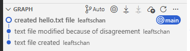
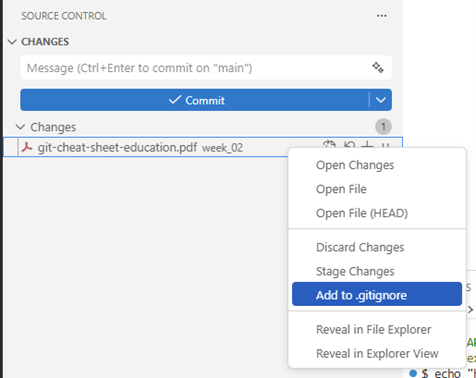
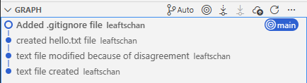
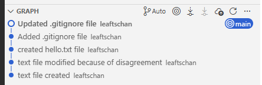

::: {=html}
<style>
.path {
  background-color: #f2f2f2;
  padding: 2px 6px;
  border-radius: 4px;
  font-family: monospace;
}
</style>
:::

**in construction!!**

Official Cheat-Sheet of Git: [link](https://git-scm.com/cheat-sheet)

Want to understand Git better? [go here](https://git-scm.com/book/en/v2)

::: {.callout-important title="We will work with our common folder structure"}
Make sure to be consistent with the folder structure below (it is the same from last week and will stay the same _throught_ the course):
```
Introduction_to_programming/
├── github_course_materials/ # is empty for now, you will clone the git repo in week 3
├── exercises/               # Student's own work
│   ├── week_01/
│   ├── week_02/
│   ├── ...
│   ├── week_12/
├── group_project/
│   ├── ...
```
:::


## Install `git` and the VSCode extension `Git Graph`

--- **This step has to be done before the exercise session.** ---

Please follow the instructions on the git website: [Git Installation Guide](https://git-scm.com/book/en/v2/Getting-Started-Installing-Git)

1. For *Windows users*, we recommend installing git via the [Git for Windows installer](https://git-scm.com/download/win).

2. For *Mac users*, git is often already installed. On Mavericks (10.9) or above you can do this simply by trying to run git from the Terminal <span style="color:red; font-weight:bold;">TODO: Powershell/Bash/CommandPrompt/...?.</span> the very first time.
  
    ```bash
    git --version
    ```
    
    If you don’t have it installed already, it <span style="color:red; font-weight:bold;">TODO: does ``it'' refer to git --version?.</span> will prompt you to install it. If you want a more up to date version, you can also install it via a binary installer.[^1] A macOS Git installer is maintained and available for download at the Git website [here](https://git-scm.com/download/mac).
    
    [^1]: A binary installer is a ready-to-run version of a program that has already been compiled into machine code for your operating system. See e.g. [this](https://www.reddit.com/r/learnprogramming/comments/lyw9gf/can_someone_explain_what_people_mean_by_binaries/) Reddit comment on the topic.
    

<span style="color:red; font-weight:bold;">TODO: Powershell/Bash/CommandPrompt/GitBash - when to use which command-line-interface.</span>

<br>

## 1. Configurate git on your machine

Follow the step here to configurate your git installation. <span style="color:red; font-weight:bold;">TODO: Powershell/Bash/CommandPrompt/...?.</span>

- `user.name`: Set the name that will be attached to your commits. This is _visible_ to collaborators when working on shared repositories. IMPORTANT: Use the _same_ email address as for your GitLab account, if you have any, since it is used for identification and linking commits to your GitLab/GitHub account

- `user.email`: Set the email address that will be attached to your commits. IMPORTANT: Use the _same_ email address as for your GitLab account, if you have any, since it is used for identification and linking commits to your GitLab/GitHub account.

- `init.defaultBranch`: Configure the default name of the initial branch when creating a new repository. Historically this was called "master", but most platforms now use "main" as the standard default branch name.

```bash
# Add your name
git config --global user.name "Your Name"

# Add your email address
git config --global user.email "your.email@unisg.ch"

# Use modern main branch name
git config --global init.defaultBranch main
```

The following commands configure how Git handles line endings across different operating systems. Windows uses a different line ending format (CRLF) than macOS/Linux (LF), which can otherwise lead to unnecessary changes showing up in version control and cause avoidable merge conflicts. Setting this option ensures a consistent file format across platforms and enables smooth collaboration. <span style="color:red; font-weight:bold;">TODO: Powershell/Bash/CommandPrompt/...?.</span>

**For Linux/Mac:**
```bash
git config --global core.autocrlf input
```

**For Windows:**
```bash
git config --global core.autocrlf true
```


<br>

## 2. Initialize a Git repository

::: {.callout-note title="Initializing"}
Initializing a Git repository means turning a normal folder into a Git-*tracked* project.
When you run `git init`, Git creates a hidden [/.git]{.path} directory that stores the version history and configuration for that folder. From that moment on, Git can track changes, create commits, and manage versions of your files in that folder and its subfolders.
:::

1. Identify the filepath of the directory [Introduction_to_programming/exercises/week_02]{.path}.
2. In the terminal <span style="color:red; font-weight:bold;">TODO: Powershell/Bash/CommandPrompt/...?.</span>, navigate to that directory. This is important. The folder you are currently in is the one Git will track.
3. Initialize a git repository using `git init`. Check your git repo using `git status`.

::: {.callout-tip collapse="true" title = "Solution"}
In your terminal from VSCode, navigate to your cd [Introduction_to_programming/exercises/week_02]{.path}. Then:

```bash
cd "path-to-your-week_02-directory"
git init
```
:::

<br>

## 3. First tracking and commit

::: {.callout-note title = "commit"}
A commit is a saved snapshot of your project at a specific point in time.
When you run `git commit`, Git records the staged changes together with a message describing what was changed. Each commit becomes part of the project’s history, allowing you to track progress, review changes, and revert to earlier versions if necessary.
:::

::: {.callout-note title = "staging area"}
The staging area is an intermediate step between your working files and a commit.
When you run `git add`, you are selecting exactly which changes should be included in the next commit - you do not need to commit *all* your changes, you can select what should be commited. This allows you to group related changes together and avoid committing unfinished or unrelated edits. In short, the staging area gives you precise control over what becomes part of the project history.
:::

::: {.callout-important title="VIM and Nano – when you forgot the `-m`"}
If you run `git commit` without the `-m` option, Git will open a text editor in the current terminal so you can write the commit message manually.

Git uses a terminal-based editor by default. On many systems this is **Vim**, on others it may be **Nano**. Both are command-line text editors.

#### If Vim opens
Vim starts in *normal mode*, where you cannot type immediately.

1. Press `i` to enter *insert mode*.
2. Type your commit message.
3. Press `Esc` to leave insert mode.
4. Type `:wq` and press `Enter` to save and quit.

If you want to exit without saving, type `:q!` instead.

#### If Nano opens
Nano is simpler:
- Just start typing your message.
- Press `Ctrl + O` to save.
- Press `Enter` to confirm.
- Press `Ctrl + X` to exit.

**Recommendation:** If you prefer not to use an editor, you can always write your commit message directly with  
`git commit -m "Your message"`.

:::

1. Check the current status of your git project in [/week_02]{.path} using `git status`.

2. In [week_02]{.path}, create a text file named `humorforprogrammers.txt` containing the sentence "*Code is like humor. When you have to explain it, it’s bad.*" using your terminal.

3. Observe what happens with `git status`. Check `git log`.

4. Output the file contents of `humorforprogrammers.txt`.

::: {.callout-tip collapse="true" title="Solution"}
Use the Git Bash, Powershell (Windows) or Bash (macOS) terminal in VSC for this task. You can also use Git Bash directly.

```bash
# 1-4:
git status
echo "Code is like humor. When you have to explain it, it’s bad." > humorforprogrammers.txt
git status
git log
cat humorforprogrammers.txt
```
:::

5. Add the file to the staging area. Check again `git status`. Remember: you can use autocomplete with the Tab key to avoid having to write the full name manually.

6. Create your first commit. Commit the new file with the commit message "text file created". Check with `git status`.

7. Change the text in `humorforprogrammers.txt` to "*Code is absolutely not like humor.*". Verify the successful change by checking the file's content in your terminal.

8. Use `git diff` to see the actual unstaged changes.

9. Add the file to the staging area, check the status, and commit the new file with the commit message "text file modified because disagreement".  Check again with `git status` and with `git log`.

::: {.callout-tip collapse="true" title="Solution"}
```bash
# 5:
git add humorforprogrammers.txt
git status

# 6:
git commit -m "text file created"
git status

# 7:
echo "*Code is absolutely not like humor.*" > humorforprogrammers.txt
cat humorforprogrammers.txt

# 8:
git diff

# 9:
git add humorforprogrammers.txt
git status
git commit -m "text file modified because disagreement"
git status
git log
```
:::

10. Look at your sidebar in VSCode. You'll notice the `git` GUI { width=20px }.
    Now create a new file `hello.txt` containing "hello world!". Observe the sidebar. Using the GUI, add `hello.txt` and commit, using a nice commit message.

::: {.callout-tip collapse="true" title="Solution"}
Create hello.txt file:
```bash
# 10:
echo "hello world!" > hello.txt
```

In the sidebar, open Git extension. Click on the plus symbol next to hello.txt to add it to the staging area.

In the message window, enter your commit message. No need to put it in quotes. Then hit commit.

You'll see a new commit in the graph window:


:::

::: {.callout-note title = "warning: in the working copy of 'humorforprogrammers.txt', LF will be replaced by CRLF the next time Git touches it"}
*Windows users* may see a warning such as:

> LF will be replaced by CRLF the next time Git touches it

This warning refers to differences in line endings between operating systems.  
macOS and Linux use **LF** (Line Feed) to mark the end of a line, while Windows uses **CRLF** (Carriage Return + Line Feed).

Because we configured `core.autocrlf=true` on Windows, Git stores files in the repository using LF (to keep things consistent across systems), but automatically converts them to CRLF in your local working directory. If a file currently contains LF line endings, Git informs you that it will convert them to CRLF the next time it modifies the file.

This is not an error and does not affect the actual content of your file. It simply ensures consistent handling of line endings and smooth collaboration across different operating systems.

macOS and Linux users (who set `core.autocrlf=input`) typically do not see this warning, since their systems already use LF line endings.
:::


<br>

## 5. Ignore some files

::: {.callout-note title=".gitignore"}
A `.gitignore` file tells Git which files or folders should not be tracked. This is useful for excluding temporary files, system files, build outputs, or sensitive information (e.g., passwords or API keys) that should not be part of the repository.

Git ignores files based on pattern matching rules defined in `.gitignore`. 
These patterns work similarly to simple regular expressions (technically they use *glob patterns*), allowing you to ignore groups of files at once.

For example:
- `*.log` ignores all log files  
- `build/` ignores the entire build folder  
- `.DS_Store` ignores macOS system files  

Ignored files will not appear in `git status` and cannot be accidentally committed.
:::

1. Make sure to still be in the [/week_02]{.path} repo.

2. If you haven't done it from the course, download the [Git Cheat Sheet](https://education.github.com/git-cheat-sheet-education.pdf) and save it in your [/week_02]{.path} folder.

3. If you want to see the pdf inside VSCode, we recommend you install the "PDF Viewer" extension.

4. Create a new [.gitignore]{.path} file to ignore only the cheatsheet. Note that there are two options:
    - Via the Git GUI in VSCode
    - Via the terminal by creating a new .gitignore file

::: {.callout-tip collapse="true" title="Solution"}
There are two options to create the gitignore: once via Git GUI and once via the terminal. We'll explain both.

- Via the Git GUI:

  
      
  That automatically creates the [.gitignore]{.path} file for you.
  
- Via the terminal:
  ```
  echo "git-cheat-sheet-education.pdf" > .gitignore
  ```
:::

5. Add all the files to your repo and commit. Notice what's happening.

6. Change the [.gitignore]{.path} file to the following file and save it. Explain what the new [.gitignore]{.path} file does. Add and commit.

```bash
# Data and generated outputs
*.csv
*.tsv
*.xlsx
*.pdf
*.png
*.jpg
*.html

# Python
__pycache__/
*.pyc

# Virtual environment (uv)
.venv/

# Editor / OS files
.DS_Store # typical for macOS!
.vscode/
```

::: {.callout-tip collapse="true" title="Solution"}
```bash
git add .
git commit -m "Added .gitignore file"
```



Copy-paste the new contents into the [.gitignore]{.path} file.

```bash
git status
git add .
git status
git commit -m "Updated .gitignore file"
```



This `.gitignore` file tells Git which files and folders should not be tracked or committed to the repository.

It ignores:

- **Data and generated outputs** (`*.csv`, `*.pdf`, `*.png`, etc.)  
  → These are typically results, exports, or large files that can be recreated and do not belong in version control.

- **Python temporary files** (`__pycache__/`, `*.pyc`)  
  → These are automatically created by Python and do not need to be stored.

- **Virtual environments** (`.venv/`)  
  → This folder contains installed packages and can be recreated from a requirements file.

- **Editor and operating system files** (`.DS_Store`, `.vscode/`)  
  → These are system- or editor-specific configuration files that should not be shared.

In short, this `.gitignore` keeps the repository clean by excluding generated, temporary, and machine-specific files.
:::


<br>

## 6. Time-Travel ⏱️

::: {.callout-note}
### commit hash
Here comes a short description
:::

::: {.callout-note}
### HEAD
Here comes a short description
:::

::: {.callout-note}
### detached head
Here comes a short description
:::

- Go back to your directory [/week_02]{.path} in exercises.

- Open the git log of your respository or call it with `git log`. From the log, identify the commit hash (identifier) of your first commit. Note that `HEAD` is used to reference commits relatively, with `HEAD` being the current commit, `HEAD~1` the previous commit, `HEAD~2` the commit two commits ago, and so on.

- Checkout the previous commit using the `git checkout` function. As seen in the course, you can checkout to a git commit using the commit identifier. Or, you can use the following syntax: `checkout HEAD~1`.

- Go back to your main branch using `git checkout`.

::: {.callout-tip collapse="true"}
#### Solution
Please complete. Make sure you are ready to explain what a detached head is and how to get back to the main branch.
:::


<br>

## 7. On 🪵, 🌲

- Navigate to your repo in [/week_02]{.path} in exercises.

- Create a new branch called `fixCode`. Checkout the new branch. Make sure you're on the right branch using `git status`. Check the different branches of your repo with `git branch`.

- Add a new file `fix.txt` containing "I fixed the code!" and save. Add and commit the change on the new branch.

- Go back to the main branch. Check the content of the directory. Do you see the new file? Why not?

- Merge the `fixCode` branch into main

- Repeat all the above steps (with a different branch name & commit) using the GUI on VSCode (*self-study*)

::: {.callout-tip collapse="true"}
#### Solution
Please complete
:::

<br>


## 8. On merge conflicts

::: {.callout-note}
### What is a merge conflict?
Here comes a short description
:::

- Create a new branch called `conflictBranch`. Checkout the new branch.

- Change the text in `humorforprogrammers.txt` to "*Code is like humor. When you have to explain it, it’s really really bad.*" and save. Add and commit the change.

- Go back to main and merge `conflictBranch` into main. Resolve the merge conflict and commit the merge.

::: {.callout-tip collapse="true"}
#### Solution
Please complete.

Make sure you are ready to explain how to deal with "forced" commit messages in the terminal (vim or nano) and in the GUI of VSCode.
:::

<br>

## Reference
Learn `git` with [learngitbranching.js.org](https://learngitbranching.js.org/).